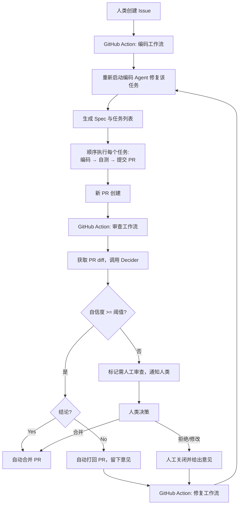

【OAIA】Github 全自动开发方案

好的，这是我们的完整方案存档，按你的要求整理为一份结构清晰的 Markdown 文档。

---

# 全自动 AI 开发闭环方案

## 1. 核心理念

构建一个 **极简、全自研、事件驱动** 的 AI 开发体系：

- **人类角色**：提出业务构想（创建 Issue），并在 AI 无法高置信度决策时介入。
- **AI 角色**：由一个编码智能体和一个审查智能体构成闭环，自动完成规划、编码、测试、审查、合入或打回的完整流程。
- **工具原则**：不依赖复杂商业软件，使用开源的 `DeepSeek TUI` 作为编码引擎，自研的 `Decider` 作为审查决策中心，运行环境可选择 GitHub Codespaces 或任意 Linux 机器。

## 2. 架构与角色

系统包含三个角色，职责分明：

| 角色 | 执行者 | 职责 |
|------|--------|------|
| 需求方 | **人类** | 在 GitHub 上创建 Issue，描述业务目标。 |
| 编码智能体 | `DeepSeek TUI` (YOLO模式) | 读取 Issue → 生成技术规格与有序任务列表 → 顺序实现每个任务（编码 + 自测） → 提交 Pull Request。 |
| 审查智能体 | 自研 `Decider` + 轻量包装脚本 | 独立审查 PR → 调用三方模型辩论决策 → 根据自信度自动执行合并/打回，或转交人类。 |

**测试环节**：内置在编码智能体的内循环中，确保每个 PR 在提交前已通过单元/集成测试。

## 3. 工具与环境

| 组件 | 选型 | 说明 |
|------|------|------|
| 代码托管 | GitHub | 私有或公开仓库均可。 |
| 执行环境 | GitHub Codespaces 或 本地 Linux 机器 | 预装 `git`、`gh` CLI、`DeepSeek TUI`。 |
| 编码引擎 | [DeepSeek TUI](https://github.com/deepseek-ai/deepseek-tui) | 开源终端 AI 编程工具，支持 YOLO 全自动模式。 |
| 审查决策 | 自研 `Decider` API | 输入“问题 + 限制”，返回 `Yes/No` + 原因 + 自信度。内部由三个顶级大模型三轮辩论得出。 |
| 编排 | GitHub Actions | 监听 Issue、PR 事件，触发编码和审查工作流。 |

> 环境无关性：只需一个能运行 CLI 工具、可访问 GitHub 和 API 的 Linux 环境。你可以随时从云上 Codespaces 迁移到本地服务器，反之亦然。

## 4. 流程图



## 5. 自动化实现细节

### 5.1 编码工作流 (`code-on-issue.yml`)

**触发**：新 Issue 被创建 (`issues: [opened]`)

**流程**：
1. 检出仓库代码。
2. 安装 `DeepSeek TUI` 和 `gh` CLI。
3. 运行编码 Agent，传入 Issue 内容和指令：
   - 读取 Issue。
   - 生成 `specs/` 和 `tasks.md`。
   - 对每个任务：创建分支 → 编码 → 运行测试直到通过 → `git commit` & `push` → 创建 PR。
   - 全部任务完成后退出。

**并发控制**：使用 `concurrency: coding-agent` 全局单例，保证同时只有一个编码 Agent 运行，避免任务冲突。

### 5.2 审查工作流 (`review-on-pr.yml`)

**触发**：PR 被创建或收到新提交 (`pull_request: [opened, synchronize]`)

**流程**：
1. 获取 PR 的 diff、标题、描述。
2. 组装输入：`问题 = PR 摘要 + diff`，`限制 = .github/pr-review-guidelines.md`。
3. 调用 `Decider API` 获取决策结果。
4. 解析结果，根据 **唯一可调参数 `REVIEW_CONFIDENCE_THRESHOLD`** 决定下一步：
   - **自信度 ≥ 阈值**：
     - 结论 `Yes` → 自动合并 PR (`gh pr merge`)。
     - 结论 `No` → 自动打回：添加包含“原因 + 修改建议”的评论，关闭 PR，添加标签 `ai-rejected`。
   - **自信度 < 阈值**：
     - 在 PR 上添加评论，附上辩论纪要，打上 `needs-human-review` 标签，通知人类。

### 5.3 修复工作流 (`fix-on-reject.yml`)

**触发**：PR 被关闭且 `merged == false`，并且带有 `ai-rejected` 标签。

**流程**：
1. 获取该 PR 的所有审查评论。
2. 在 `main` 分支上重新启动编码 Agent，传入“需要修复的任务”和审查意见。
3. 编码 Agent 创建新分支、修复代码、自测通过后创建新 PR。
4. 重试计数器：在 Issue 中记录重试次数，若超过 3 次，停止自动修复，标记为 `needs-human-intervention`。

## 6. 唯一控制参数：自信度阈值

| 阈值 | 效果 |
|------|------|
| 0% | 完全自动，Decider 所有结论直接执行合并/打回。 |
| 70% (推荐) | 高度自动，三方一致同意的决策自动执行；有分歧的提交给人类。 |
| 100% | 所有决策都转交人类，Decider 只提供参考意见。 |

阈值可通过仓库的 `vars.REVIEW_CONFIDENCE_THRESHOLD` 或工作流环境变量调整，随时热更新。

## 7. 任务持久化与状态管理

- **任务列表**：`tasks.md`，由编码 Agent 生成并维护，每个任务标记状态（`[ ]`/`[x]`）。
- **重试计数**：在每个 Issue 的隐藏列表或独立的状态文件中记录，防止无限循环修复。
- **标签体系**：
  - `ai-rejected`：被 AI 打回，待修复。
  - `needs-human-review`：需人工介入。
  - `coding`：编码 Agent 正在处理。

## 8. 潜在问题与对策

| 问题 | 对策 |
|------|------|
| 编码 Agent 与审查 Agent 的死循环 | 单任务最大重试 3 次，之后停止自动修复，通知人类。 |
| 多个 Issue 并发导致代码冲突 | 全局 `concurrency` 确保编码 Agent 单实例运行，形成自然任务队列。 |
| GitHub Actions 运行时长限制（6小时） | 使用自托管 Runner（本地 Linux 机器）可解除限制；或拆分更大的任务。 |
| API 成本过高 | 自信度阈值本身就是成本控制旋钮；也可在 Decider 内部加入缓存或预审。 |

## 9. 仓库目录结构示例

```
.
├── .github/
│   ├── workflows/
│   │   ├── code-on-issue.yml
│   │   ├── review-on-pr.yml
│   │   └── fix-on-reject.yml
│   ├── scripts/
│   │   └── review-pr.sh          # 调用 Decider 的主脚本
│   └── pr-review-guidelines.md   # 审查原则
├── specs/                        # 自动生成的技术规格
├── tasks.md                      # 当前任务清单
└── README.md
```

## 10. 你的日常工作流

1. 有想法时，在仓库创建一个 Issue。
2. 收到 GitHub 通知：
   - “PR #XX 已自动合并” —— 功能已上线。
   - “PR #XX 需要人工审查” —— 登录 GitHub，在 PR 下做出最终决策。
3. 若发现某个功能反复被驳回，检查 Issue 中的重试记录，调整需求或审查原则。
4. 如果想调整自动化程度，只需修改 `REVIEW_CONFIDENCE_THRESHOLD` 的值。

---

此方案完成了从 **Issue 创建** 到 **代码审查与合入** 的全自动闭环，工具链极简且完全自控，可随时部署在云上或个人服务器。祝构建顺利！
